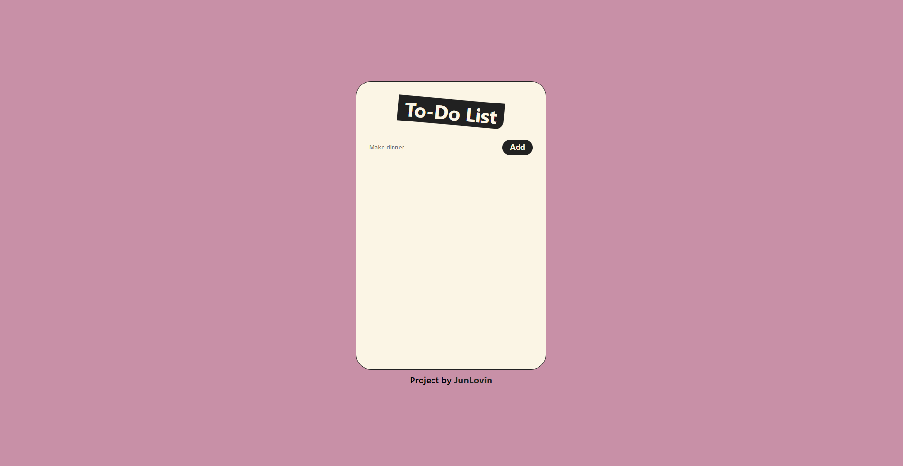
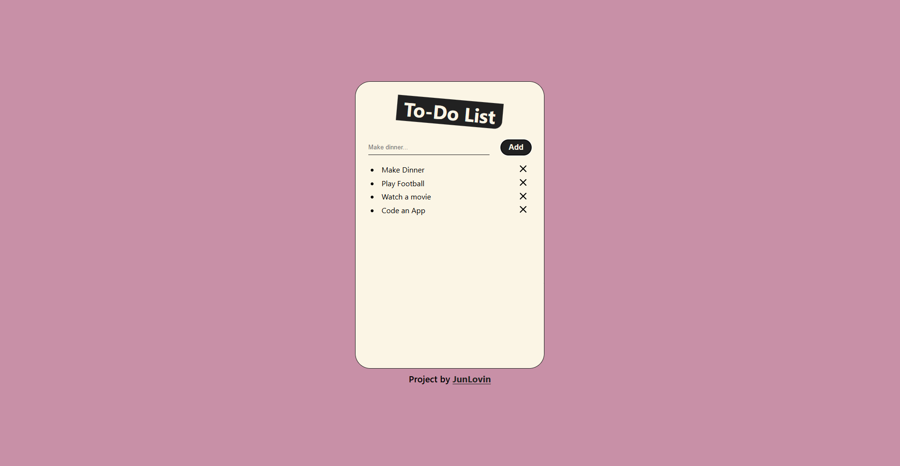
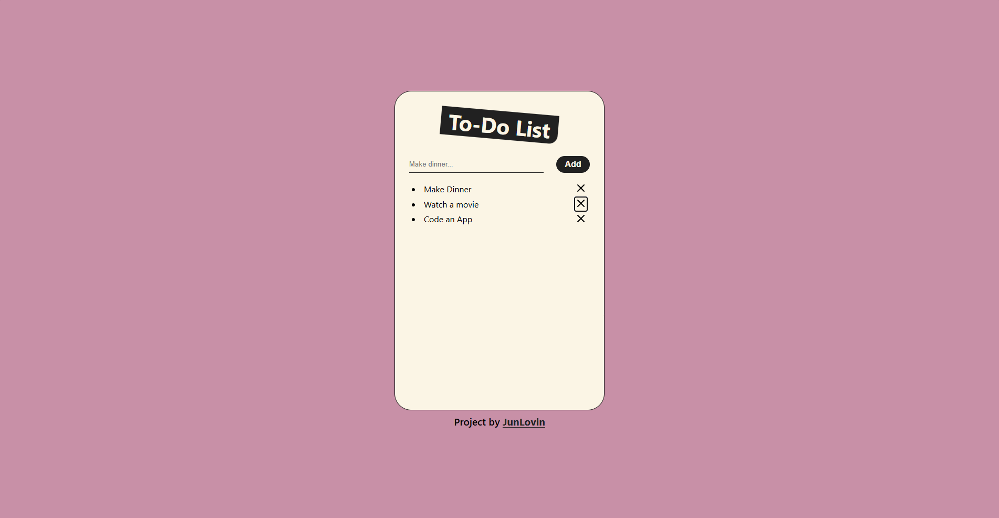

# To-Do List

A simple project to learn more about useState() Hook using React. To make new to-do just type in input field and push "Add" button, this create new `<li>` tag and show it. If you can see my project [click here](https://to-do-list-three-jade-41.vercel.app/). Also you can give me feedback.

## Screenshot

## How Works

Using [`useState()`](https://react.dev/reference/react/useState) Hook.

The value in text field it's saved in a variable, then just click the button and the value is showed like `<li>` tag, to remove that list item just click `X` button.

